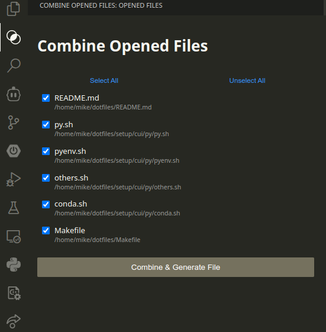

# vscode-combine-opened-files

This extension consolidates the contents of multiple files into one, allowing you to easily copy and paste the project context into prompts for AI.



install from the command line:

```bash
code --install-extension 3265.vscode-combine-opened-files
```

## License

This extension is licensed under the [MIT License](LICENSE).
